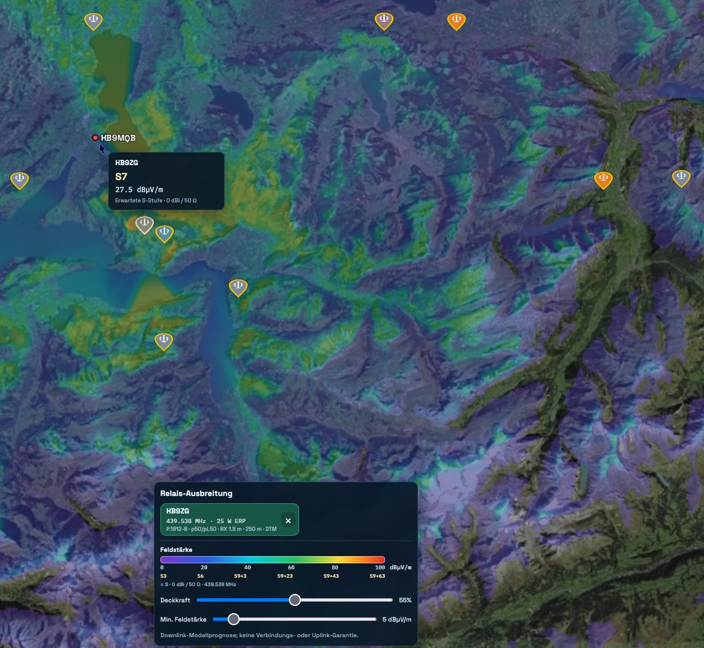
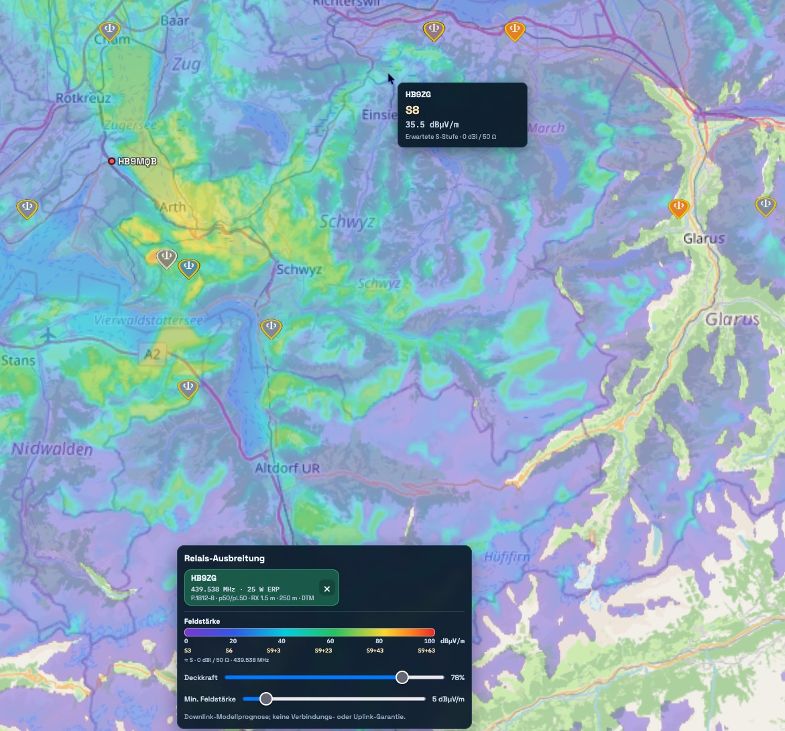
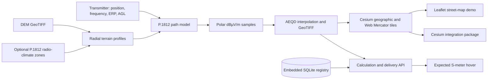

# HamRelay Field Strength

[](https://github.com/hb9mqb/HamRelay-FieldStrength/actions/workflows/ci.yml)
[](LICENSE)
[](https://www.itu.int/rec/R-REC-P.1812/en)
[](pyproject.toml)
[](docs/DEPLOYMENT.md)

Reproducible, terrain-aware repeater field-strength maps with an embedded
station registry, a complete Leaflet street-map demo, numerical web tiles,
Cesium integration components, and expected S-meter values under explicit
receiver assumptions. The primary result is always an electric field strength in
**dBµV/m**—never a decorative or binary coverage shape.

Author: **Beat W. Meier, HB9MQB**

**[Quick start](#quick-start) · [Live API contract](docs/API.md) ·
[Demo guide](docs/DEMO.md) · [Integration](docs/INTEGRATION.md) ·
[Scientific paper](paper/paper.pdf) · [Contribute](CONTRIBUTING.md)**

> [!IMPORTANT]
> This is a planning model. It does not guarantee communication. Buildings,
> foliage, antenna patterns, polarization mismatch, feed-line loss, interference,
> receiver implementation, weather, and short-term propagation can materially
> change real reception.

## Project status and scope

Version 0.1.0 is the first published self-contained field-strength component.
The current development line adds explicit clutter and P.1812 radio-climate
inputs for production host integration.
Its intentionally bounded scope is:

- calculation of terrain-aware repeater fields in dBµV/m;
- GeoTIFF, numeric tiles, colored overlays, and strongest-field composites;
- reusable Leaflet/Cesium integration patterns and controls; and
- geographic field sampling with an expected S-meter indication.

It can be embedded as a pinned Python dependency or OCI container. A host
application remains responsible for its own authoritative station database,
source merging, authentication, durable scheduling, artifact-retention policy,
and globe or map shell. Those are clean integration boundaries, not duplicated
features. See [Host integration](docs/INTEGRATION.md) and the explicit
[replacement-readiness contract](docs/REPLACEMENT-READINESS.md) before removing
an existing implementation.

## Why this project exists

Many repeater maps reduce propagation to a single-color visibility footprint.
That is useful for orientation, but it hides whether a location is predicted at
5 or 75 dBµV/m and cannot support a meaningful threshold or cursor readout.
This project instead:

- calculates path-specific field strength with ITU-R P.1812-8;
- uses terrain profiles over all azimuths and real ERP when supplied;
- treats the first 250 m with the P.525 free-space expression because P.1812
  requires a sufficiently long terrain profile;
- represents the result on one absolute, station-independent color scale;
- publishes stable 0.5 dB-quantized numerical tiles in addition to rendered
  color tiles;
- lets a browser change opacity and the 0–50 dBµV/m display threshold without
  pretending that the physics changed;
- reports an expected S indication only after applying a stated idealized
  antenna and impedance conversion; and
- records model version, inputs, sampling, units, and assumptions in a manifest.

The scientific method and its limitations are described in the
[paper](paper/paper.pdf). See [MODEL.md](docs/MODEL.md) for the engineering
contract and [VALIDATION.md](docs/VALIDATION.md) for the validation strategy.

## Integration example



This example shows a calculated repeater overlay integrated into an interactive
map client:

- the purple-to-red surface is the transparent propagation layer; each color
  represents an absolute predicted electric field in dBµV/m;
- the pointer popup samples the numerical raster at that geographic position
  and shows 27.5 dBµV/m together with the derived expected S7 indication;
- the horizontal legend retains one station-independent 0–100 dBµV/m color
  scale and adds frequency-dependent expected S references below it;
- **Opacity** blends the overlay with the chosen base map without changing any
  calculated value;
- **Minimum field strength** hides values below the selected 0–50 dBµV/m
  threshold without modifying or recalculating the stored GeoTIFF; and
- the station card identifies the active artifact and records frequency, ERP,
  propagation model, terrain sampling, and DEM provenance.

The base map and analysis layer are independent. The screenshot uses imagery to
make terrain structure obvious; the included `/demo/` application applies the
same Web Mercator overlay to an attributed street map. Switching base maps,
overlays, or stations does not change the camera position or zoom.



The street-map view demonstrates that the numerical overlay is not tied to
satellite imagery or a specific map vendor. Roads, settlements, lakes, and
administrative labels remain readable below the adjustable transparent layer.
At the sampled location the popup reports 35.5 dBµV/m and derives an expected
S8 reading under the documented ideal 0 dBi / 50 Ω receiver reference. The
field raster, legend thresholds, station metadata, and cursor sampling are
identical in both views; only the base map has changed.

## Architecture



The calculator, artifact service, demo, and web package are deliberately
separated. SQLite is embedded for zero-configuration station storage; an
external database server or application framework is not required.

## Apple M5 and Metal

The native macOS calculation path is optimized for Apple M5: P.1812 rays run
across selected performance cores, large terrain grids are shared between
spawned workers, nested numerical thread pools are suppressed, and an optional
fused MLX/Metal kernel accelerates polar-to-Cartesian rasterization. Install it
with `python -m pip install -e '.[apple]'`. The manifest identifies whether
`mlx-metal-polar-v1` or the equivalent NumPy backend produced the raster.

See [PERFORMANCE.md](docs/PERFORMANCE.md) for measurement requirements and
contribution ideas for Linux, experimental Windows, CUDA, ROCm, SYCL, Vulkan
and WebGPU. The repository does not claim an unimplemented GPU backend.

## Quick start

### Fastest start: Docker

Download the repository archive, extract it, and run:

```bash
cp .env.example .env
docker compose up -d
curl http://127.0.0.1:8765/v1/health
```

Open <http://127.0.0.1:8765/demo/> for the interactive street-map demo or
<http://127.0.0.1:8765/docs> for OpenAPI. The demo exposes the full reference
workflow in one screen: station filters and editing, radius and terrain mode,
calculation status, transparent or background-rendered GeoTIFF selection,
one bounded layer containing either an individual or strongest-field composite
overlay, opacity, the 0–50 dBµV/m
threshold, absolute legend, pointer field/S-meter inspection, and downloads.
The fresh Docker database is seeded with the real HB9ZG Rigi-Scheidegg example
from [examples/stations.json](examples/stations.json). Seed records are inserted
only when their station ID is absent, so later starts never replace edited data.
On a fresh start HB9ZG is selected automatically and the 5 km quick-test radius
is ready. Press **Calculate selected** once; the demo then displays the real
P.1812 result, legend, hover readings, and download links automatically.

The compose file uses the downloadable multi-architecture image
`ghcr.io/hb9mqb/hamrelay-field-strength:latest` when published; add
`--build` to build locally. The first calculation in `auto` terrain mode
downloads only the required public Copernicus GLO-30 COG tiles and caches them,
with per-tile GLO-90 fallback. The container downloads the integral P.1812 maps
directly from the official ITU archive at startup and never republishes them in
the image.

Persistent artifacts, DEM cache, ITU data, and the embedded station database
live below `runtime/`. The service binds to `127.0.0.1` by
default. Configure TLS, authentication, rate limits and explicit CORS origins
before making calculation endpoints public. Docker runs the CPU/NumPy backend;
native macOS is required for M5 Metal acceleration.

### 1. Install

Python 3.11+ and GDAL-compatible Rasterio wheels are required.

```bash
git clone https://github.com/hb9mqb/HamRelay-FieldStrength.git
cd HamRelay-FieldStrength
python -m venv .venv
source .venv/bin/activate
python -m pip install --upgrade pip
python -m pip install -e '.[dev]'
```

The pinned Py1812 implementation needs the `DN50.TXT` and `N050.TXT` digital
products distributed with ITU-R P.1812-8. Follow the upstream
[Py1812 instructions](https://github.com/eeveetza/Py1812#integrating-itu-digital-products).
These files are not redistributed here.

### 2. Prepare a request

Copy [examples/calculation.json](examples/calculation.json) and point `dem_paths`
to one or more co-registered GeoTIFFs. If `erp_w` is absent, the documented
fallback is 12 W. The radius is capped at 100 km.

```bash
hamrelay-field-strength calculate --config examples/calculation.json
hamrelay-field-strength tiles \
  --geotiff artifacts/TEST-UHF-001/field-strength.tif \
  --output artifacts/TEST-UHF-001/tiles
```

### 3. Serve artifacts

```bash
export FIELD_STRENGTH_ARTIFACT_ROOT="$PWD/artifacts"
uvicorn hamrelay_field_strength.service:app --host 127.0.0.1 --port 8765
```

OpenAPI is available at `http://127.0.0.1:8765/docs`. Production deployments
should place this read-only service behind TLS and a cache/CDN; never expose a
database directly to a public browser.

### 4. Add the browser overlay

```bash
cd web && npm install && npm run build
```

```ts
import {
  CoverageOverlayController,
  FieldStrengthApi,
  SMeterHover,
  createLegend,
} from "@hamrelay/field-strength-overlay";

const api = new FieldStrengthApi("https://coverage.example.org");
const coverage = new CoverageOverlayController(viewer, api, {
  opacity: 0.7,
  minimumFieldStrengthDbuvM: 5,
});

coverage.setVisibleStations(["TEST-UHF-001"]); // camera is left unchanged
document.body.append(createLegend());

const hover = new SMeterHover(viewer, api, () => ["TEST-UHF-001"], {
  render: (sample, position) => renderPopup(sample, position),
});
```

When a station filter changes, call `setVisibleStations(filteredStationIds)`.
Each station remains an independent layer and can be toggled without changing
map position, zoom, heading, or pitch.

## Calculation defaults

| Parameter | Default | Meaning |
|---|---:|---|
| Propagation method | ITU-R P.1812-8 | 30 MHz–6 GHz path-specific field model |
| Maximum radius | 100 km | Practical project boundary |
| ERP | source value, else 12 W | Effective radiated power |
| Terrain profile step | 50 m | DEM sampling along each ray |
| Radial field step | 200 m | P.1812 endpoint spacing |
| Output grid | 60 m | Publication grid; not a claim of 60 m model accuracy |
| Minimum rays | 360 | Full 360° coverage |
| Outer-arc target | 500 m | Raises ray count for large radii |
| Receiver height | 1.5 m AGL | Planning receiver |
| Time/location | 50% / 50% | Median planning conditions |
| Polarization | vertical | Configurable per station |
| Display threshold | 5 dBµV/m | UI default, adjustable from 0–50 |

Spatial output resolution, input DEM post spacing, terrain-profile sampling,
angular sampling, and propagation-model accuracy are different concepts. The
manifest reports each independently to prevent false precision.

## API at a glance

| Method | Path | Purpose |
|---|---|---|
| `GET` | `/v1/health` | Liveness |
| `GET` | `/v1/capabilities` | Client feature and limit discovery |
| `GET` | `/v1/stations` | Filtered station registry |
| `PUT` | `/v1/stations/{id}` | Authenticated station upsert |
| `POST` | `/v1/stations/import` | Authenticated bulk import |
| `POST` | `/v1/calculations` | Optional job submission with 0.25–100 km radius |
| `GET` | `/v1/calculations/{job_id}` | Calculation status |
| `GET` | `/v1/coverage/{id}/manifest` | Inputs, provenance, range, model |
| `GET` | `/v1/coverage/{id}/field-strength.tif` | Requested Float32 GeoTIFF download |
| `GET` | `/v1/coverage/{id}/field-strength-visual.tif` | Transparent/map/street-map RGBA GeoTIFF |
| `GET` | `/v1/coverage/{id}/tiles/{z}/{x}/{y}.png` | Thresholded RGBA tile |
| `GET` | `/v1/coverage/{id}/web-tiles/{z}/{x}/{y}.png` | Leaflet/OSM Web Mercator tile |
| `GET` | `/v1/coverage/{id}/values/{z}/{x}/{y}.png` | Stable 8-bit numerical tile |
| `GET` | `/v1/coverage/{id}/sample?latitude_deg=…&longitude_deg=…` | Field and expected S reading |
| `POST` | `/v1/samples` | Batch sample and strongest station |
| `GET` | `/v1/composites/web-tiles/{z}/{x}/{y}.png` | Strongest-field composite |

The value-tile encoding reserves zero for NoData. Values 1–255 represent
`-20 + (value - 1) × 0.5 dBµV/m`. Full schemas, status codes, caching semantics,
and examples are in [API.md](docs/API.md).

## Data and licensing

Project code is MIT licensed. Propagation implementations, elevation models,
land-cover products, base maps, and ITU digital products retain their own
licenses. Nothing in the MIT license grants rights to third-party data.

Recommended worldwide terrain input is Copernicus DEM GLO-30. It is a digital
surface model (not a bare-earth DTM), has approximately 30 m latitude spacing,
and requires the attribution described in its Product Handbook. Higher-quality
regional DTMs can be supplied without changing the calculation contract.
See [DATA-SOURCES.md](docs/DATA-SOURCES.md).
The release-level summary is in
[THIRD_PARTY_NOTICES.md](THIRD_PARTY_NOTICES.md).

## Reproducibility and validation

Every artifact manifest records transmitter inputs, model and implementation
revision, sampling geometry, output resolution, field range, worker count, and
explicit assumptions. A scientific claim requires more than a visually plausible
map: compare predicted fields against calibrated mobile or fixed measurements,
retain withheld validation routes, and publish residual statistics by terrain and
distance. The repository intentionally distinguishes implementation conformance
from empirical accuracy.

## Contributing

This project is looking for radio engineers, propagation researchers, field
measurement teams, GIS developers, performance specialists, web developers,
technical writers, accessibility reviewers, and curious radio amateurs. A small
reproducible validation case or a careful documentation correction can be as
valuable as a large feature.

Contributions are welcome, especially:

- calibrated measurement datasets with defensible metadata;
- independent P.1812 conformance tests;
- radio-climate and clutter adapters with clear provenance;
- uncertainty visualization and residual analysis;
- accessibility, WebGL performance, and non-Cesium clients; and
- reproducible benchmarks on Apple silicon, Linux ARM64, and x86-64.

The project is also seeking scientific co-authors. Contributors whose work
substantially advances the method, calibrated validation, reproducible
implementation, performance research, or scientific manuscript may be invited
to co-author a future paper revision. The transparent authorship criteria and
responsibilities are documented in [CONTRIBUTING.md](CONTRIBUTING.md).

Windows code and CI configuration are included, but the Windows execution path
is explicitly **experimental and not yet tested**. See
[WINDOWS.md](docs/WINDOWS.md); please help turn the prepared port into a
measured, reproducible compatibility claim.

Read [CONTRIBUTING.md](CONTRIBUTING.md), open an issue before a large change,
and keep physical assumptions explicit. A colorful result is not sufficient;
new propagation behavior must be testable and scientifically referenced.

The complete documentation map is in [docs/README.md](docs/README.md). Use
[SUPPORT.md](SUPPORT.md) to choose the right issue form, and see the public
[roadmap](docs/ROADMAP.md) for well-bounded contribution ideas.

## Citation

Use [CITATION.cff](CITATION.cff), or cite the accompanying paper:

> Beat W. Meier, HB9MQB. “Reproducible Terrain-Aware Repeater Field-Strength
> Mapping with ITU-R P.1812.” 2026.

## License

Copyright © 2026 Beat W. Meier, HB9MQB. Released under the [MIT License](LICENSE).
