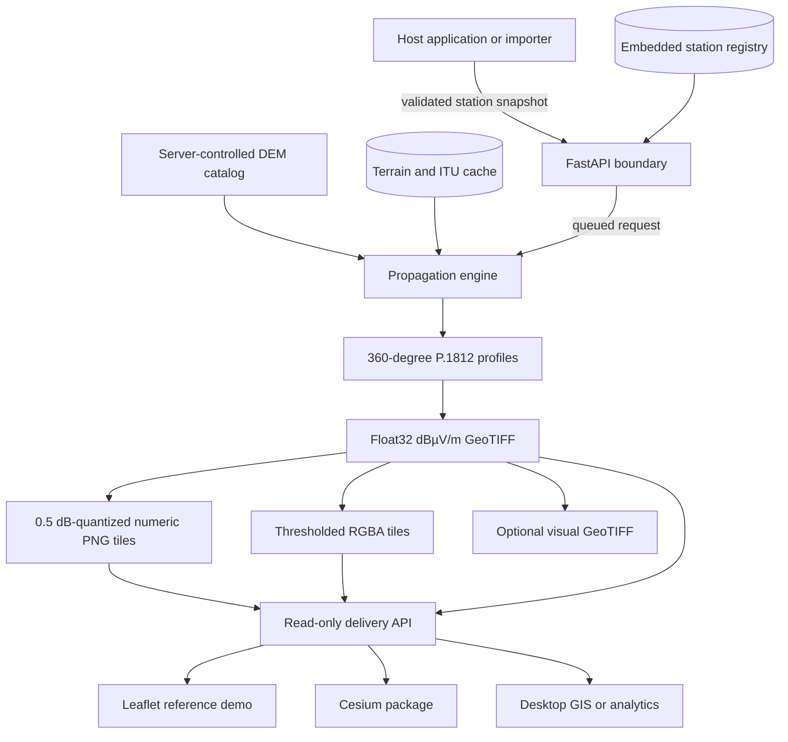

# Architecture

HamRelay Field Strength is a bounded propagation subsystem, not a replacement
for a host product's identity, station-ingest, map, or membership features. It
can run as a Python library, a calculation and delivery service, or a pinned
container. The same numerical artifact is consumed by both the Leaflet demo and
the Cesium integration package.

## Component view

## Correctness boundaries

The system deliberately keeps five concerns separate:

1. **Station truth.** Position, frequency, ERP, antenna height, polarization,
   provenance, and any manual coordinate lock belong to a station registry. A
   host may remain authoritative and send immutable calculation snapshots.
2. **Terrain truth.** The server resolves dataset identifiers to trusted local
   paths or downloads an explicitly supported public dataset. Browser clients
   can never submit filesystem paths.
3. **Physical calculation.** The engine produces a Float32 electric-field
   raster in dBµV/m. Presentation thresholds and opacity never modify it.
4. **Publication.** Numeric tiles preserve sample values; RGBA tiles are only a
   view. A production host should publish versioned, checksummed artifacts
   atomically.
5. **Presentation.** Map layers, legends, and S-meter estimates consume the
   API. Adding or removing a layer must not change camera position, zoom,
   bearing, or pitch.

This separation makes it possible to validate the physics independently of a
specific database, web framework, globe, or base-map provider.

## Calculation flow

For each transmitter, the engine:

1. validates the station and radius;
2. loads a projected terrain grid covering the complete analysis circle;
3. samples geodesic terrain profiles over at least 360 azimuths;
4. evaluates successive path endpoints with ITU-R P.1812-8, using the P.525
   free-space expression below P.1812's practical minimum path length;
5. interpolates polar field samples onto an azimuthal-equidistant grid;
6. reprojects the result to EPSG:4326 without changing its physical unit;
7. writes provenance and assumptions next to the raster; and
8. derives numeric tiles, presentation tiles, and optional visual GeoTIFFs.

On Apple silicon, independent P.1812 rays are distributed across selected
performance cores. Immutable terrain arrays use shared memory. The optional
MLX/Metal path accelerates polar rasterization; it does not replace P.1812 or
alter the scientific model.

## Storage modes

The bundled SQLite database is ideal for the demo, standalone deployments, and
portable test fixtures. In an integrated deployment, it may be treated as a
local registry/cache while the host's central database remains authoritative.
Synchronize through authenticated APIs or a dedicated adapter; never give a
public browser direct database access.

Artifacts are independent of the registry after publication. The minimal unit
of exchange is:

- the Float32 field-strength GeoTIFF;
- its manifest and dataset provenance;
- numeric tiles or a documented deterministic way to recreate them; and
- an immutable station calculation identifier.

## Deployment profiles

| Profile | Calculation | Registry | Delivery | Intended use |
|---|---|---|---|---|
| Native library | In process | Host-owned | Host-owned | batch and research workflows |
| All-in-one container | In-process reference runner | SQLite | FastAPI | evaluation, demos, small private installations |
| Split production | Durable worker | Host or adapter | read-only API/CDN | public websites and large catalogs |

The bundled background-task runner is intentionally small. A production
deployment that must survive process restarts should retain the HTTP request
schema but execute jobs in a durable queue.

## Trust model

- Public clients may read metadata, tiles, rasters, samples, and capabilities.
- Station mutation requires an API key in the reference server.
- Calculation should be authenticated and rate-limited because it consumes
  substantial CPU, memory, storage, and external-data bandwidth.
- DEM and base-map paths are selected only from server-side catalogs.
- A reverse proxy terminates TLS and applies request/body/time limits.
- Private station data, credentials, proprietary terrain, and ITU digital map
  files are not part of public artifacts unless their licenses permit it.

See [Deployment](DEPLOYMENT.md) and [Host integration](INTEGRATION.md) for the
operational patterns.
