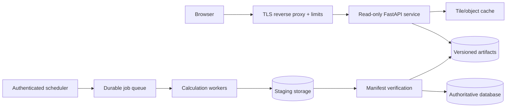

# Deployment

The reference container is designed for quick evaluation and small private
installations. Public or high-volume deployments should separate expensive
calculation from read-only delivery and use immutable releases.

## Local container

```bash
cp .env.example .env
docker compose up --build -d
curl --fail http://127.0.0.1:8765/v1/health
```

Open `http://127.0.0.1:8765/demo/` for the demo and `/docs` for OpenAPI. Runtime
state is mounted below `runtime/`; removing the container does not remove the
database, DEM cache, ITU data, or artifacts.

## Persistent volumes

| Path | Purpose | Backup policy |
|---|---|---|
| `runtime/database` | embedded station registry | back up after curated edits |
| `runtime/artifacts` | numerical and presentation outputs | back up or reproduce from recorded inputs |
| `runtime/dem-cache` | downloaded terrain | cache; preserve attribution metadata |
| `runtime/itu` | licensed/official digital products | manage under upstream terms |
| `runtime/dem` | optional operator-supplied DEM | source-controlled outside Git where licensing requires |
| `runtime/basemaps` | optional licensed visual backgrounds | follow provider terms |

The repository ignores all runtime directories. Never commit private databases,
credentials, proprietary terrain, or ITU map files.

## Important environment variables

| Variable | Meaning |
|---|---|
| `FIELD_STRENGTH_ARTIFACT_ROOT` | station artifact root |
| `FIELD_STRENGTH_DATABASE` | SQLite file for standalone registry |
| `FIELD_STRENGTH_DEM_CATALOG` | trusted server-side terrain catalog |
| `FIELD_STRENGTH_BASEMAP_CATALOG` | optional local background rasters |
| `FIELD_STRENGTH_DEM_CACHE` | automatic terrain cache |
| `FIELD_STRENGTH_ENABLE_CALCULATIONS` | opt-in calculation endpoint |
| `FIELD_STRENGTH_ADMIN_API_KEY` | station-write credential |
| `FIELD_STRENGTH_CORS_ORIGINS` | explicit comma-separated browser origins |
| `FIELD_STRENGTH_WORKERS` | `auto` or 1–256 operator-selected ray workers |
| `FIELD_STRENGTH_SEED_STATIONS` | optional initial JSON seed; empty disables |
| `FIELD_STRENGTH_PORT` | host port used by Compose |
| `MEMORY_LIMIT` | Compose memory limit |

Replace the example API key before any network exposure. Keep secrets in the
deployment secret store, not `.env` files committed to Git.

## Public architecture



Expose only read routes to anonymous visitors. Calculations, station writes, and
catalog administration should use a private route or separate service with
authentication, quotas, rate limits, request-size limits, and audit logging.

Recommended proxy behavior:

- TLS 1.2 or newer and HSTS after validation;
- exact CORS origins, never `*` with credentials;
- strict body and request-time limits;
- longer internal timeouts only for job submission, not tile delivery;
- rate limits on sample and composite endpoints;
- CDN/cache keys that include station version and display threshold; and
- security headers appropriate to the host application.

## Artifact publication

The reference service writes one current station directory. A production
adapter should strengthen this with versioned paths and an atomic pointer:

1. calculate into a unique staging directory;
2. fsync/close every file;
3. validate manifests, hashes, rasters, and a sample tile;
4. move the immutable version into place atomically;
5. commit the ready version in the central database;
6. smoke-test delivery; and
7. retain the previous version for rollback.

Do not delete an old version merely because a new calculation started. Garbage
collection must check active references and a retention window.

## Scaling

P.1812 calculations are CPU- and memory-intensive. Scale workers independently
from web delivery. Do not run multiple Uvicorn worker processes against the
reference in-memory job dictionary; use a durable external queue first. Limit
concurrent calculations according to measured memory use and terrain-grid size.

Tile delivery is read-heavy and cacheable. Put immutable numeric tiles and
versioned color tiles behind object storage or a CDN. Point sampling may remain
on the API or be implemented from numeric tiles in a trusted browser client.

## Upgrade and rollback

- Deploy immutable version tags, never an unpinned `latest` in production.
- Record image digest/package commit, model identifiers, dataset versions, and
  manifest schema with each artifact.
- Run the replacement gates in [Replacement readiness](REPLACEMENT-READINESS.md).
- Preserve the previous image and active artifact pointer until the rollback
  window closes.
