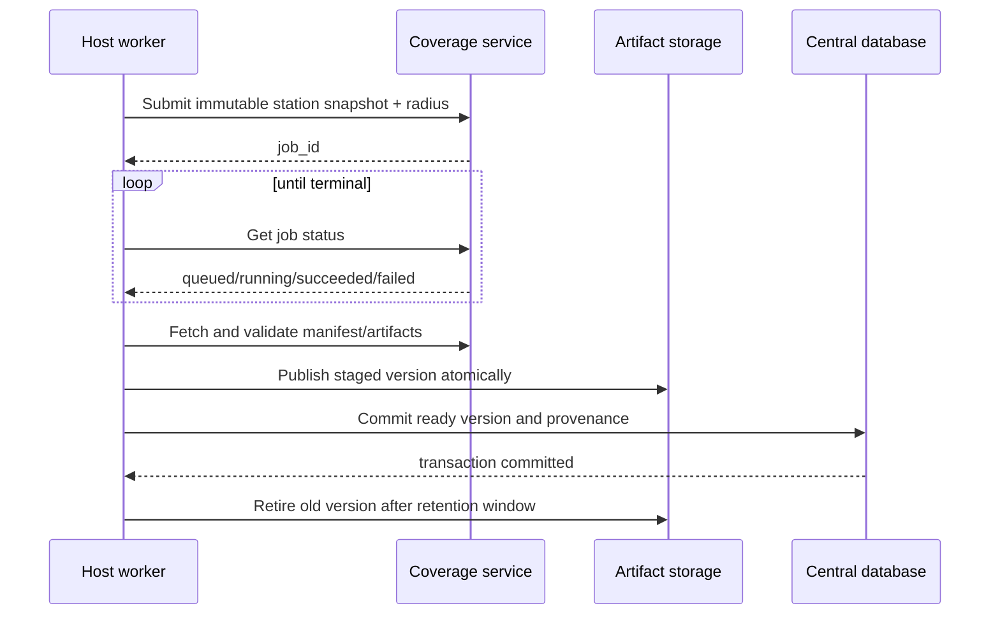

# Host Integration

This guide describes how an existing website, globe, station database, or batch
pipeline can consume HamRelay Field Strength without copying its source into the
host repository.

## Recommended ownership model

The host application remains authoritative for:

- station identity and public IDs;
- curated or manually locked coordinates;
- source merging, retirement, and status policy;
- authentication and user permissions; and
- map navigation and non-coverage layers.

HamRelay Field Strength owns:

- propagation inputs captured for one calculation;
- DEM selection and provenance;
- P.1812 calculation and numerical field artifacts;
- color and value tiles;
- field/S-meter point sampling; and
- overlay reference components.

This boundary prevents an update run from overwriting curated coordinates and
allows the propagation engine to be upgraded or rolled back independently.

## Integration choices

### Pinned Python dependency

Use a signed release tag or immutable commit in the host's worker environment.
The host reads station snapshots from its central database, constructs
`CalculationRequest`, invokes `calculate`, validates the manifest, and publishes
the resulting directory. This has the lowest service overhead and is suitable
when the host already has durable scheduling and artifact storage.

### Pinned OCI container

Run the published image beside the host. The host imports station snapshots
through the authenticated API, submits calculation jobs, polls their status,
and consumes tiles through an internal URL. This provides the strongest runtime
separation and the fastest initial integration.

### Hybrid production deployment

Use the Python package inside durable workers and expose only read-only artifact,
tile, and sampling routes to browsers. This is the recommended high-volume
architecture: a failed public API restart cannot lose queued work, and public
requests cannot trigger expensive propagation calculations.

Do not copy source files into the host and then let them diverge. Pin a release,
record the version in every artifact, and upgrade deliberately.

## Station synchronization

A host can send an inline station with each calculation or upsert a registry
record first. The calculation snapshot should include:

```json
{
  "id": "immutable-public-id",
  "latitude_deg": 47.05639,
  "longitude_deg": 8.51750,
  "frequency_mhz": 439.5375,
  "erp_w": 25,
  "antenna_height_agl_m": 20,
  "polarization": "vertical"
}
```

Use actual ERP when the source supplies it and the documented 12 W fallback
only when it does not. Preserve an explicit `power_assumed` flag in host
metadata. A manually corrected coordinate must be locked in the authoritative
registry before synchronization. The embedded registry's `coordinates_locked`
field protects the same invariant for standalone imports.

Calls signs are not globally unique calculation keys: a site can host multiple
modes and frequencies with the same call sign. Prefer the host's immutable UUID
or another stable station identifier.

## Calculation and publication sequence



For production, calculate into a staging directory. Verify files, hashes,
units, model identifiers, bounds, and tile readability before changing the
central database pointer. Keep the previous ready version until the database
transaction and a browser smoke test both succeed.

## Map integration

Use Web Mercator tiles with Leaflet, MapLibre, or OpenLayers and geographic
tiles with Cesium. The current API provides both. A filter can be translated to
one strongest-field composite request:

```text
/v1/composites/tiles/{z}/{x}/{y}.png
  ?station_ids=id-1,id-2,id-3
  &minimum_field_strength_dbuv_m=5
  &opacity=0.7
```

Composite values are a pixel-wise maximum, never a coherent sum. For
independent station toggles, use one `CoverageOverlayController` layer per
station. For large filter results, prefer a server composite so the browser
owns one bounded map layer.

Adding, removing, or recoloring an overlay must not call `flyTo`, `setView`,
`fitBounds`, or an equivalent camera method. Preserve center, zoom, heading,
pitch, and map mode across station clicks and base-map changes.

## Legend and cursor inspection

The color scale always represents dBµV/m. Opacity and the minimum-display
slider are presentation parameters and must be encoded in tile URLs or layer
state, never written back into the field raster.

For a cursor popup, debounce mouse movement, cancel superseded requests, and
sample only visible stations. `POST /v1/samples` returns the strongest result
and all available samples. The S indication is a derived receiver-reference
estimate; show the numeric dBµV/m result as the primary value.

## API exposure

Browsers should reach a same-origin reverse proxy or a narrowly configured CORS
endpoint. Recommended public routes are:

- `/v1/capabilities`, `/v1/legend`, and read-only station metadata;
- coverage manifests and downloads;
- color, value, and composite tiles; and
- point/batch sampling.

Keep station writes and calculations on an authenticated internal route. Never
publish a Postgres or SQLite connection to the browser.

## Version upgrade protocol

1. Pin the candidate release in a staging worker.
2. Recalculate a representative fixture set: flat, mountain, coastal, border,
   low-power, default-power, and manually locked stations.
3. Compare units, bounds, hashes, profiles, raster statistics, thresholded
   areas, and selected point samples.
4. Exercise the real host frontend against candidate API/artifacts.
5. Canary a small production subset while retaining the old ready artifacts.
6. Promote only when monitoring and visual smoke tests pass.
7. Remove legacy code only after a documented rollback window.

The detailed gate is in [Replacement readiness](REPLACEMENT-READINESS.md).
